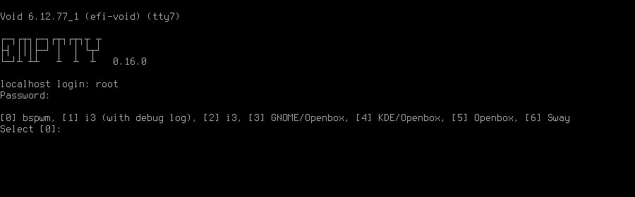

# emptty
[](https://github.com/tvrzna/emptty/releases/latest)
[](https://github.com/tvrzna/emptty/actions?query=workflow:Build)
[](https://goreportcard.com/report/github.com/tvrzna/emptty)

Dead simple CLI Display Manager on TTY



[](https://repology.org/project/emptty/versions)

## Configuration

__NOTE__: Please be aware that emptty does not source any kind of `.profile` scripts by default. If you want to use them, please see [samples](SAMPLES.md).

---

#### /etc/emptty/conf
Default startup configuration. On each change it requires to restart emptty.

`TTY_NUMBER` TTY, where emptty will start.

`SWITCH_TTY` Enables switching to defined TTY number. Default is true.

`PRINT_ISSUE` Enables printing of /etc/issue in daemon mode.

`PRINT_MOTD` Enables printing of default motd, static motd or dynamic motd.

`DEFAULT_USER` Preselected user, if AUTOLOGIN is enabled, this user is logged in.

`DEFAULT_SESSION` Preselected desktop session, if user does not use `emptty` file. Has lower priority than `AUTOLOGIN_SESSION`

`DEFAULT_SESSION_ENV` Optional environment of preselected desktop session, if user does not use `emptty` file. Possible values are "xorg" and "wayland".

`AUTOLOGIN` Enables Autologin, if DEFAULT_USER is defined. Possible values are "true" or "false". Default value is false.
__NOTE:__ to enable autologin DEFAULT_USER must be in group nopasswdlogin, otherwise user will NOT be authorized.

`AUTOLOGIN_SESSION` The default session used, if Autologin is enabled. If session is not found in list of session, it proceeds to manual selection.

`AUTOLOGIN_SESSION_ENV` Optional environment of autologin desktop session. Possible values are "xorg" and "wayland".

`AUTOLOGIN_MAX_RETRY` If Autologin is enabled and session does not start correctly, the number of retries in short period is kept to eventually stop the infinite loop of restarts. -1 is for infinite retries, 0 is for no retry. Default value is 2.

`LANG` defines locale for all users. Default value is "en_US.UTF-8"

`DBUS_LAUNCH` Prepends "dbus-launch" before desktop command. Default value is true. If `.emptty` is handled as script, this config is overriden to false.

`XINITRC_LAUNCH` Starts Xorg desktop with calling "\~/.xinitrc" script, if is true, file exists and selected WM/DE is Xorg session, it overrides DBUS_LAUNCH. If `.emptty` is handled as script, this config is overriden to false.

`VERTICAL_SELECTION` Prints available WM/DE each on new line instead of printing on single line.

`LOGGING` Defines the way, how is logging handled. Possible values are "default", "appending" or "disabled". Default value is "default".

`LOGGING_FILE` Overrides path of log file. Default value is `/var/log/emptty/[TTY_NUMBER].log`.
__NOTE:__ It expects existence of directories to defined logging file.

`XORG_ARGS` Arguments passed to Xorg server.

`DYNAMIC_MOTD` Allows to use dynamic motd script to generate custom MOTD. Possible values are "true" or "false". Default value is false.
__NOTE:__ Be sure, that dynamic motd has correct content and permissions (e.g. 744), the script is started as default user; in daemon mode it means `root`.

`DYNAMIC_MOTD_PATH` Allows to override default path to dynamic motd. Default value is `/etc/emptty/motd-gen.sh`

`MOTD_PATH` Allows to override default path to static motd. Default value is `/etc/emptty/motd`

`FG_COLOR` Foreground color, available only in daemon mode. List of colors is listed below.

`BG_COLOR` Background color, available only in daemon mode. List of colors is listed below.

`DISPLAY_START_SCRIPT` Script started before Display (Xorg/Wayland) starts.
__NOTE:__ The script is started as default user; in daemon mode it means `root`.

`DISPLAY_STOP_SCRIPT` Script started after Display (Xorg/Wayland) stops.
__NOTE:__ The script is started as default user; in daemon mode it means `root`.

`ENABLE_NUMLOCK` Enables numlock in daemon mode. Possible values are "true" or "false". Default value is false.

`SESSION_ERROR_LOGGING` Defines how logging of session errors is handled. Possible values are "default", "appending" or "disabled". Default value is "disabled".

`SESSION_ERROR_LOGGING_FILE` Overrides path of session errors log file. Default value is `/var/log/emptty/session-errors.[TTY_NUMBER].log`.
__NOTE:__ It expects existence of directories to defined logging file.

`NO_XDG_FALLBACK`
Disallows setting of fallback values for all XDG environmental variables and leaves it on Login Controls. Possible values are "true" or "false". Default value is false.
__NOTE:__ Be aware, that setting to "true" could lead to unexpected behaviour.

`DEFAULT_XAUTHORITY`
If set true, it will not use `.emptty-xauth` file, but the standard `~/.Xauthority` file. This allows to handle xauth issues. Possible values are "true" or "false". Default value is false.

`ROOTLESS_XORG`
If set true, Xorg will be started as rootless, if system allows and emptty is running in daemon mode. Possible values are "true" or "false". Default value is false.

`IDENTIFY_ENVS`
If set true, environemntal groups are printed to differ Xorg/Wayland/Custom/UserCustom desktops. Possible values are "true" or "false". Default value is false.

#### Dynamic MOTD
If `DYNAMIC_MOTD` is set to `true`, this file exists and is executable for its owner, the result is printed as your own MOTD. Be very careful with this script!

#### Static MOTD
Custom file, that prints your own MOTD. Reading this file supports colors (e.g. `\x1b[31m` or `\033[32m`).

#### ${HOME}/.config/emptty or ${HOME}/.emptty
Optional configuration file, that could be also handled as shell script. If is not presented, emptty shows selection of installed desktops.
Configuration file stored as `${HOME}/.config/emptty` has higher priority on loading.
See [samples](SAMPLES.md#emptty-as-config)

`Name` Optional name to be used as Session Name.

`Exec` Defines command to start Desktop Environment/Window Manager. This value does not need to be defined, if .emptty file is presented as shell script (with shebang at the start and execution permissions).

`Environment` Selects, which environment should be defined for following command. Possible values are "xorg" and "wayland", "xorg" is default.

`Lang` Defines locale for logged user, has higher priority than LANG from global configuration

`Selection` Requires selection of desktop, basically turns `emptty` file into `.xinitrc` for Xorg and Wayland. In this case `Exec` is skipped.

`LoginShell` Defines custom shell to be used to start the session. This allows to start the session with non-interactive shell e.g. `/bin/bash --login`

#### /etc/emptty/custom-sessions/ or ${HOME}/.config/emptty-custom-sessions/
Optional folders for custom sessions, that could be available system-wide (in case of `/etc/emptty/custom-sessions/`) or user-specific (in case of `${HOME}/.config/emptty-custom-sessions/`), but do not have .desktop file stored on standard paths for Xorg or Wayland sessions. Expected suffix of each file is ".desktop".
See [samples](SAMPLES.md#custom-sessions)

`Name` Defines name of Desktop Environment/Window Manager.

`Exec` Defines command to start Desktop Environment/Window Manager.

`Environment` Selects, which environment should be defined for following command. Possible values are "xorg" and "wayland", "xorg" is default.

#### ${HOME}./xinitrc
If config `XINITRC_LAUNCH` is set to true, it enables possibility to use .xinitrc script. See [samples](SAMPLES.md#xinitrc)

#### Colors
Please, be aware that `LIGHT_` colors could be unavailable as background color.
<details>
  <summary>List of colors</summary>
  <ul>
	<li>BLACK</li>
	<li>RED</li>
	<li>GREEN</li>
	<li>YELLOW</li>
	<li>BLUE</li>
	<li>PURPLE</li>
	<li>CYAN</li>
	<li>WHITE</li>
	<li>LIGHT_BLACK</li>
	<li>LIGHT_RED</li>
	<li>LIGHT_GREEN</li>
	<li>LIGHT_YELLOW</li>
	<li>LIGHT_BLUE</li>
	<li>LIGHT_PURPLE</li>
	<li>LIGHT_CYAN</li>
	<li>LIGHT_WHITE</li>
 </ul>
</details>

## Logging
As it is mentioned in configuration, there are three options to handle logging of emptty. The logs contains not just logs from emptty, but also from Xorg (if used) and user's WM/DE.
Described log location could differ according configuration `LOGGING_FILE`, that is stored in `/etc/emptty/conf`.

#### default
This option provides simple solution, when current instance of `emptty` logs into `/var/log/emptty/[TTY_NUMBER].log` and the previous version is stored as `/var/log/emptty/[TTY_NUMBER].log.old`.

__NOTE:__ Current instance always move previous log into old file, if `emptty` crashes and is started again, previous log is in `/var/log/emptty/[TTY_NUMBER].log.old`.

#### appending
This option provides functionality that logs everything into `/var/log/emptty/[TTY_NUMBER].log` and does not handle log rotation by itself. It leaves the option for user to handle it themselves (e.g. with logrotate).

__NOTE:__ Appending without roration could cause large log file, be sure that log file is rotated.

#### disabled
This option points all log into `/dev/null`, so no log is available.

__NOTE:__ If any issue starts to appear and you want to report it, ensure you do not use this option.

## Build & install

### Build dependencies
- go
- gcc
- pam-devel
- libx11-devel (libx11)

### Dependencies
- pam
- libx11
- xorg / xorg-server (optional)
- xauth / xorg-xauth (required for xorg)
- mcookie (required for xorg)
- wayland (optional)


### Commands
---
- `make clean` to cleanup already built binary.
- `make build` to build binary and gzip man page.
---
- `make install` to install binary.
- `make install-pam` to install pam module.
- `make install-pam-debian` to install pam module for Debian.
- `make install-pam-fedora` to install pam module for Fedora.
- `make install-pam-suse` to install pam module for openSUSE.
- `make install-manual` to install man page.
- `make install-all` to install binary, pam module and man page.
---
- `make install-config` to create default conf file in /etc/emptty/.
- `make install-runit` to install runit service.
- `make install-runit-artix` to install runit to Artix service folder.
- `make install-openrc` to install openrc service.
- `make install-s6` to install s6 service.
- `make install-systemd` to install systemd service.
- `make install-motd-gen` to create default motd-gen.sh in /etc/emptty/.
---
- `make uninstall` to remove emptty from your system
---

### Build tags
Different distros could handle libc dependencies in different ways and `emptty` have direct references to these libc functions. For these cases there are Build tags to disable incompatible functionality or just to avoid some unwanted dependency.
The usage during build is really simple, just add parameter and optional tags split with ",".
```
$ make build TAGS=tag1,tag2
```

#### nopam
This tag disables dependency on PAM. In Linux it switch to basic authentication with `shadow`. For OpenBSD there is simple `bsd_auth` authentication.

#### noxlib
This tag disables dependency on libx11, could be useful, if only Waylend desktop is expected to be used.

#### noutmp
This tag disables dependency on UTMP/UTMPX. Its implementation is different by each libc/distro, this provides ability to build if incompatibility occurs.
